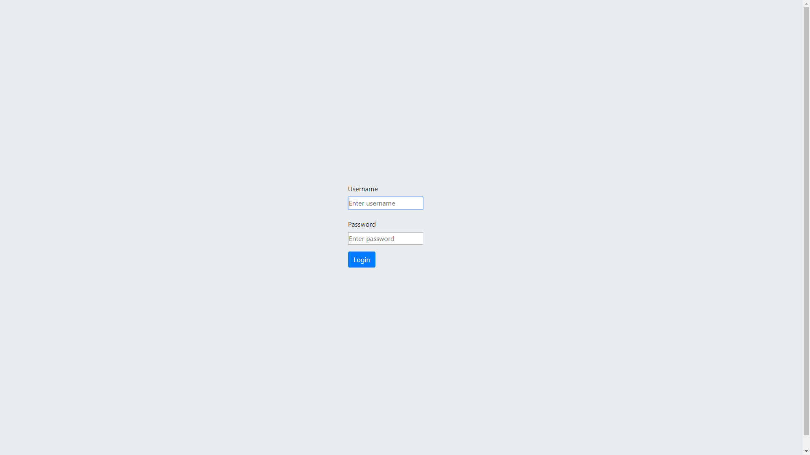
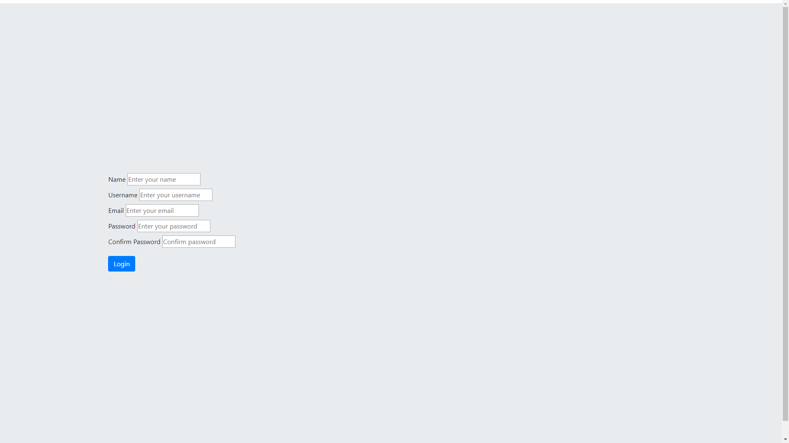
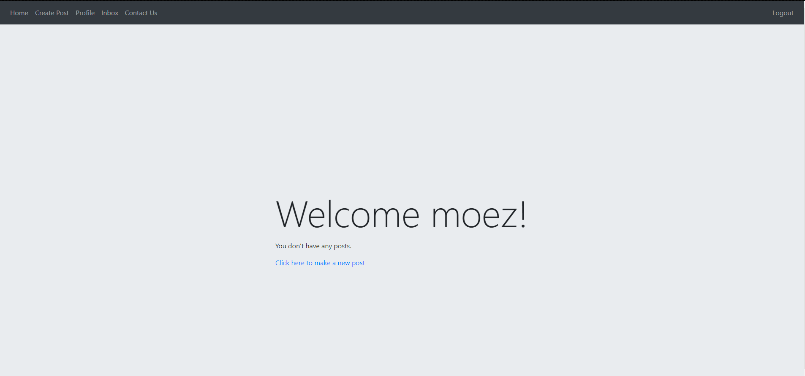
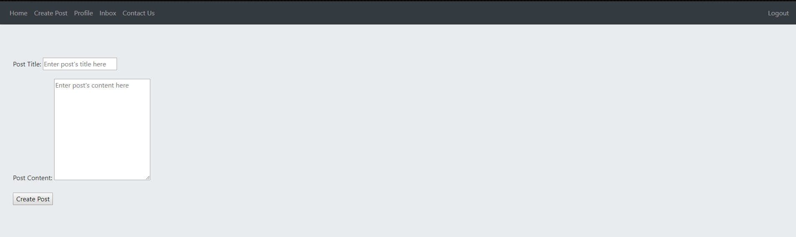
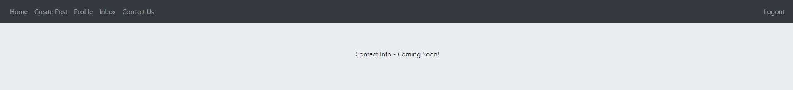

#Case Study

### This application was created using HTML/CSS/JS/Bootstrap4 for the front end, MariaDB for the database, and Java backend using Spring MVC, Spring Security, Spring Data JPA and other tools. This application is a **__work in progress__** and will be completed over time.

---

### Home Page

---

### Login Page

---

### Registration Page

---
### Sample User Homepage

---
### Create New Post

---
### Contact Page

